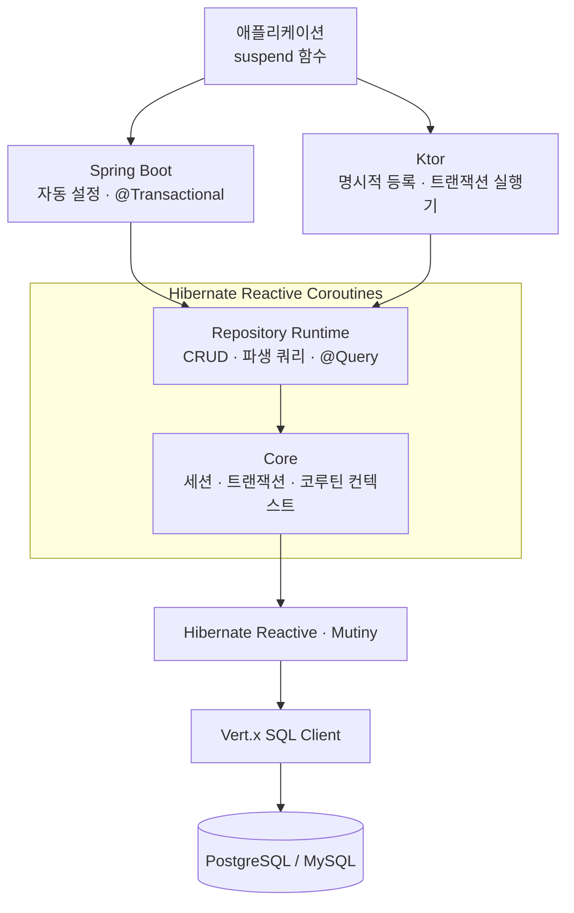

# Hibernate Reactive Coroutines

[](https://central.sonatype.com/artifact/io.clroot/hibernate-reactive-coroutines-core)
[](https://github.com/clroot/hibernate-reactive-coroutines/actions/workflows/ci.yml)
[](https://kotlinlang.org)
[](https://hibernate.org/reactive/)
[](https://spring.io/projects/spring-boot)
[](https://ktor.io)

[English](README.md) | **한국어**

> Hibernate Reactive를 Kotlin Coroutines답게 사용하는 리포지토리와 트랜잭션 도구입니다.

`Uni`·`CompletionStage` 같은 리액티브 타입을 직접 다루지 않고, `suspend` 함수와 `Flow`만으로 데이터베이스에 접근합니다.
리포지토리 `Flow`는 cold이지만 스트리밍하지 않습니다. collect할 때 쿼리 결과 전체를 메모리에 올린 뒤 방출합니다.
Spring Boot에서는 자동 설정을, Ktor에서는 명시적으로 구성하는 애플리케이션 플러그인을 제공합니다.

## 핵심 기능

- 코루틴 기반 CRUD와 Spring Data 방식의 파생 쿼리(`findByEmail`, `existsByStatus` 등)
- `@Query`, `@Param`, `@Modifying`을 이용한 JPQL/HQL 및 Native SQL
- 페이지네이션, 정렬, Auditing(생성·수정 시각 자동 기록)
- Spring `@Transactional`과 명시적 `ReactiveTransactionExecutor`
- Spring Boot 3/4 및 Ktor 3 통합
- CI에서 기동 검증하는 [Spring Boot](examples/spring-boot) 및 [Ktor](examples/ktor) 실행 예제

## 아키텍처



세션과 트랜잭션은 코루틴 컨텍스트를 따라 전파되며, 실제 데이터베이스 I/O는 Hibernate Reactive와
Vert.x가 논블로킹으로 처리합니다.

## 설치

| 환경 | 선택할 모듈 |
| --- | --- |
| Spring Boot 3 | `hibernate-reactive-coroutines-spring-boot-starter` |
| Spring Boot 4 | `hibernate-reactive-coroutines-spring-boot-starter-boot4` |
| Ktor 3 | `hibernate-reactive-coroutines-ktor` |

```kotlin
val hrcVersion = "2.0.0"

dependencies {
    // 사용하는 환경에 맞는 모듈 하나를 선택합니다.
    implementation("io.clroot:hibernate-reactive-coroutines-spring-boot-starter:$hrcVersion")
    // implementation("io.clroot:hibernate-reactive-coroutines-spring-boot-starter-boot4:$hrcVersion")
    // implementation("io.clroot:hibernate-reactive-coroutines-ktor:$hrcVersion")

    runtimeOnly("io.vertx:vertx-pg-client:5.1.5")
}
```

최신 버전은 위 Maven Central 배지에서 확인할 수 있습니다.
Java 21 이상이 필요하며, Spring Boot는 3.4.x와 4.x를, Ktor는 3.5.x를 지원합니다.

## Spring Boot 빠른 시작

`User`는 일반적인 JPA 엔티티입니다. Spring Data의 `CoroutineCrudRepository`를 상속한 인터페이스는
스타터가 자동으로 스캔하여 빈으로 등록하므로, `@Repository`를 붙일 필요가 없습니다.

```kotlin
import io.clroot.hibernate.reactive.repository.query.Query
import org.springframework.data.repository.kotlin.CoroutineCrudRepository
import org.springframework.stereotype.Service
import org.springframework.transaction.annotation.Transactional

interface UserRepository : CoroutineCrudRepository<User, Long> {
    suspend fun findByEmail(email: String): User?

    @Query("FROM User u WHERE u.active = true ORDER BY u.name")
    suspend fun findActiveUsers(): List<User>
}

@Service
class UserService(private val users: UserRepository) {
    @Transactional
    suspend fun create(user: User): User = users.save(user)

    @Transactional(readOnly = true)
    suspend fun findByEmail(email: String): User? = users.findByEmail(email)
}
```

```yaml
spring:
  datasource:
    url: jdbc:postgresql://localhost:5432/mydb
    username: user
    password: password
  jpa:
    database-platform: org.hibernate.dialect.PostgreSQLDialect
    hibernate:
      ddl-auto: validate
```

스타터가 리포지토리 빈, `SessionFactory`, Vert.x 인스턴스, 트랜잭션 관리자를 자동으로 구성합니다.

## Ktor 빠른 시작

Ktor에서는 Spring Data 대신 이 라이브러리가 제공하는 `CoroutineCrudRepository`를 상속하고,
리포지토리를 플러그인에 명시적으로 등록합니다.

```kotlin
import io.clroot.hibernate.reactive.ktor.HibernateReactive
import io.clroot.hibernate.reactive.ktor.hibernateRepository
import io.clroot.hibernate.reactive.ktor.hibernateTransactionExecutor
import io.clroot.hibernate.reactive.repository.CoroutineCrudRepository

interface UserRepository : CoroutineCrudRepository<User, Long> {
    suspend fun findByEmail(email: String): User?
}

fun Application.module() {
    install(HibernateReactive) {
        database {
            url = "postgresql://localhost:5432/mydb"
            username = "user"
            password = "password"
            schemaGeneration = "validate"
        }
        repository<UserRepository, User, Long>()
    }

    val users = hibernateRepository<UserRepository>()
    val tx = hibernateTransactionExecutor

    routing {
        post("/users") {
            val user = call.receive<User>()
            val saved = tx.transactional { users.save(user) }
            call.respond(saved)
        }
        get("/users/{email}") {
            val found = tx.readOnly { users.findByEmail(call.parameters["email"]!!) }
            call.respond(found ?: HttpStatusCode.NotFound)
        }
    }
}
```

Ktor 플러그인은 요청마다 트랜잭션을 자동으로 시작하지 않습니다. 위 예시처럼 `transactional {}` 또는
`readOnly {}`로 트랜잭션 경계를 직접 지정해야 합니다.

## 알아두기

- Hibernate Reactive는 동기 방식의 Lazy Loading을 지원하지 않습니다. 연관 엔티티는 Fetch Join이나 `fetch()`로
  명시적으로 불러와야 합니다.
- `Propagation.REQUIRES_NEW`는 최상위 트랜잭션을 시작할 때는 동작합니다. 중첩
  `REQUIRES_NEW`는 부모가 커넥션을 보유한 채 자식이 새 커넥션을 요구해 풀이 고갈될 수 있으므로
  지원하지 않습니다. 구현이 중첩 사용을 런타임에 거부하지는 않습니다.
- 트랜잭션 블록 안에서는 블로킹 I/O를 실행하지 않아야 합니다. 테스트에서 블로킹 호출을 탐지하려면
  BlockHound 모듈을 사용할 수 있습니다.
- Spring Boot 3(Spring Framework 6)는 Hibernate ORM 7을 지원하지 않기 때문에, 같은 애플리케이션에서
  `spring-boot-starter-data-jpa`와 함께 사용할 수 없습니다. 두 영속성 방식을 함께 써야 한다면 모듈을
  분리하거나 Spring Boot 4를 사용하세요.

## 문서

- [사용 가이드](docs/usage-guide.ko.md): 설정, 쿼리, 트랜잭션, Spring/Ktor 사용법
- [마이그레이션 가이드](docs/migration.ko.md): Spring Data JPA 호환 범위와 전환 방법
- [내부 동작](docs/internals.ko.md): 세션, 트랜잭션, 리포지토리 런타임 구조

## 라이선스

[MIT License](LICENSE)
