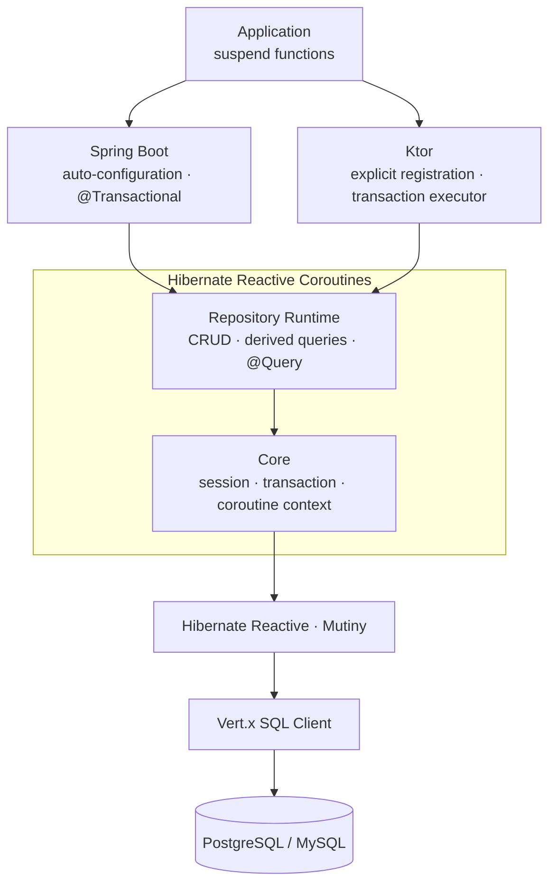

# Hibernate Reactive Coroutines

[](https://central.sonatype.com/artifact/io.clroot/hibernate-reactive-coroutines-core)
[](https://github.com/clroot/hibernate-reactive-coroutines/actions/workflows/ci.yml)
[](https://kotlinlang.org)
[](https://hibernate.org/reactive/)
[](https://spring.io/projects/spring-boot)
[](https://ktor.io)

**English** | [한국어](README.ko.md)

> Coroutine-first repositories and transactions for Hibernate Reactive.

Write `suspend` functions and `Flow`s. Repository `Flow`s are cold but not streaming: collection
loads the complete query result into memory before emitting it. Never touch `Uni` or `CompletionStage`.
Spring Boot apps get auto-configuration out of the box; Ktor apps get a plugin with explicit wiring.

## Features

- Coroutine CRUD plus Spring Data-style derived queries such as `findByEmail` and `existsByStatus`
- JPQL/HQL and native SQL via `@Query`, `@Param`, and `@Modifying`
- Pagination, sorting, and auditing with automatic created/modified timestamps
- Spring `@Transactional` support, or an explicit `ReactiveTransactionExecutor` when you want control
- First-class integrations for Spring Boot 3/4 and Ktor 3
- Runnable [Spring Boot](examples/spring-boot) and [Ktor](examples/ktor) application demos that
  exercise transactions, auditing, pagination, and association fetching in CI

## Architecture



Sessions and transactions travel with the coroutine context. Hibernate Reactive and Vert.x handle
the actual database I/O, so nothing blocks along the way.

## Installation

| Environment | Module |
| --- | --- |
| Spring Boot 3 | `hibernate-reactive-coroutines-spring-boot-starter` |
| Spring Boot 4 | `hibernate-reactive-coroutines-spring-boot-starter-boot4` |
| Ktor 3 | `hibernate-reactive-coroutines-ktor` |

```kotlin
val hrcVersion = "2.0.2"

dependencies {
    // Pick the module that matches your stack.
    implementation("io.clroot:hibernate-reactive-coroutines-spring-boot-starter:$hrcVersion")
    // implementation("io.clroot:hibernate-reactive-coroutines-spring-boot-starter-boot4:$hrcVersion")
    // implementation("io.clroot:hibernate-reactive-coroutines-ktor:$hrcVersion")

    runtimeOnly("io.vertx:vertx-pg-client:5.1.5")
}
```

Check the Maven Central badge above for the latest release.
Requires Java 21+. Supports Spring Boot 3.4.x and 4.x, and Ktor 3.5.x.

## Spring Boot Quick Start

`User` is a plain JPA entity. The starter scans for interfaces that extend Spring Data's
`CoroutineCrudRepository` and registers them as beans, so there is no need for `@Repository`.

```kotlin
import io.clroot.hibernate.reactive.repository.query.Query
import org.springframework.data.repository.kotlin.CoroutineCrudRepository
import org.springframework.stereotype.Service
import org.springframework.transaction.annotation.Transactional

interface UserRepository : CoroutineCrudRepository<User, Long> {
    suspend fun findByEmail(email: String): User?

    @Query("FROM User u WHERE u.active = true ORDER BY u.name")
    suspend fun findActiveUsers(): List<User>
}

@Service
class UserService(private val users: UserRepository) {
    @Transactional
    suspend fun create(user: User): User = users.save(user)

    @Transactional(readOnly = true)
    suspend fun findByEmail(email: String): User? = users.findByEmail(email)
}
```

```yaml
spring:
  datasource:
    url: jdbc:postgresql://localhost:5432/mydb
    username: user
    password: password
  jpa:
    database-platform: org.hibernate.dialect.PostgreSQLDialect
    hibernate:
      ddl-auto: validate
```

The starter wires up everything else: repository beans, the `SessionFactory`, the Vert.x instance,
and the transaction manager.

## Ktor Quick Start

Ktor has no Spring Data, so repositories extend this library's own `CoroutineCrudRepository` and
are registered with the plugin by hand.

```kotlin
import io.clroot.hibernate.reactive.ktor.HibernateReactive
import io.clroot.hibernate.reactive.ktor.hibernateRepository
import io.clroot.hibernate.reactive.ktor.hibernateTransactionExecutor
import io.clroot.hibernate.reactive.repository.CoroutineCrudRepository

interface UserRepository : CoroutineCrudRepository<User, Long> {
    suspend fun findByEmail(email: String): User?
}

fun Application.module() {
    install(HibernateReactive) {
        database {
            url = "postgresql://localhost:5432/mydb"
            username = "user"
            password = "password"
            schemaGeneration = "validate"
        }
        repository<UserRepository, User, Long>()
    }

    val users = hibernateRepository<UserRepository>()
    val tx = hibernateTransactionExecutor

    routing {
        post("/users") {
            val user = call.receive<User>()
            val saved = tx.transactional { users.save(user) }
            call.respond(saved)
        }
        get("/users/{email}") {
            val found = tx.readOnly { users.findByEmail(call.parameters["email"]!!) }
            call.respond(found ?: HttpStatusCode.NotFound)
        }
    }
}
```

The plugin never opens a transaction on its own. Wrap each unit of work in `transactional {}` or
`readOnly {}`, as in the routes above.

## Good to Know

- There is no synchronous lazy loading in Hibernate Reactive. Fetch associations up front with a
  fetch join, or call `fetch()` explicitly.
- `Propagation.REQUIRES_NEW` works when it starts a top-level transaction. Nested
  `REQUIRES_NEW` is unsupported: the parent keeps one connection while the child requests another,
  which can exhaust the pool. The implementation does not reject nested use at runtime.
- Keep blocking I/O out of transaction blocks. The BlockHound module catches accidental blocking
  calls in your tests.
- Spring Boot 3 (Spring Framework 6) cannot run Hibernate ORM 7, so this starter and
  `spring-boot-starter-data-jpa` cannot share a Boot 3 application. Either split the two persistence
  stacks into separate modules or move to Spring Boot 4.

## Documentation

- [Usage Guide](docs/usage-guide.md): configuration, queries, transactions, and the Spring/Ktor APIs
- [Migration Guide](docs/migration.md): what carries over from Spring Data JPA, and what changes
- [Internals](docs/internals.md): how sessions, transactions, and the repository runtime fit together

## License

[MIT License](LICENSE)
