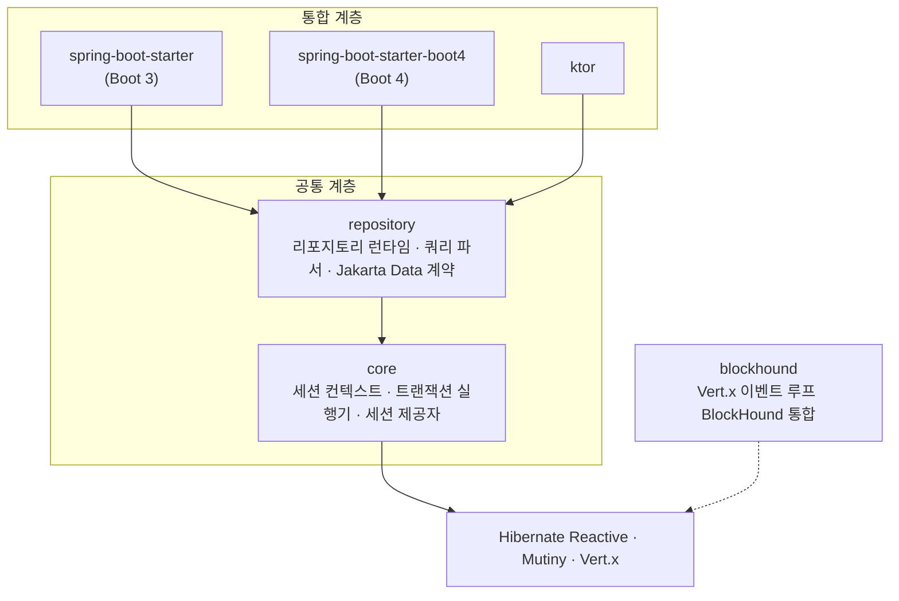
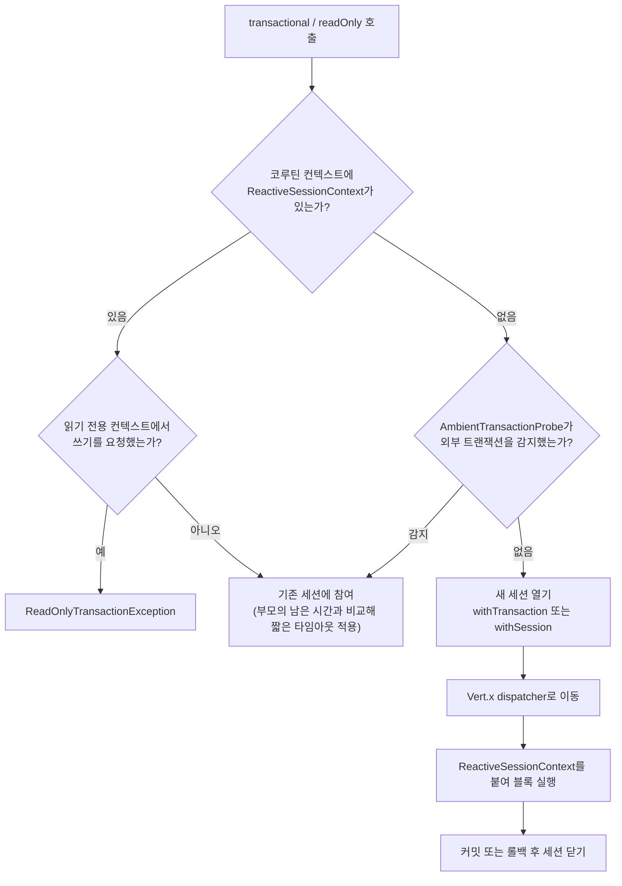
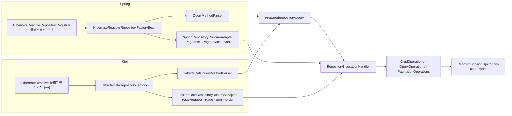

# 내부 동작

세션과 트랜잭션이 코루틴을 따라 전파되는 방식과, 리포지토리 프록시가 메서드 호출을 쿼리로 바꾸는
과정을 설명합니다. 사용법은 [사용 가이드](usage-guide.ko.md)에 있습니다.

## 1. 모듈 구성



| 모듈 | 역할 | 의존성 |
| --- | --- | --- |
| `core` | `ReactiveSessionContext`, `ReactiveTransactionExecutor`, `ReactiveSessionProvider` | Hibernate Reactive, Mutiny Kotlin, Vert.x, kotlinx.coroutines |
| `repository` | 리포지토리 런타임, 파생 쿼리 파서, `@Query` 어노테이션, Jakarta Data 기반 `CoroutineCrudRepository` | `core`, Jakarta Data API |
| `spring-boot-starter`, `-boot4` | 자동 설정, `@Transactional` 통합, Spring Data 타입 어댑터, Auditing | `repository`, Spring Boot BOM |
| `ktor` | 애플리케이션 플러그인, 리소스 소유권, Ktor DI 브리지, 사용자 Auditing | `repository`, Ktor Server |
| `blockhound` | Vert.x 이벤트 루프를 BlockHound 검사 대상으로 등록 | BlockHound, Vert.x |

두 Spring 스타터는 `spring-boot-starter-common/src` 하나를 소스 세트로 공유하고, 각각 Boot 3 BOM과
Boot 4 BOM으로 컴파일합니다. Boot 버전마다 다른 클래스는 문자열 이름으로 참조합니다.

## 2. 세션과 코루틴 컨텍스트

### 2.1 ReactiveSessionContext

세션 전파의 단위는 `CoroutineContext.Element`인 `ReactiveSessionContext`입니다.
`withContext(context)`로 감싼 블록 안의 모든 `suspend` 함수가 같은 세션을 봅니다.

| 필드 | 의미 |
| --- | --- |
| `session` | 공유하는 `Mutiny.Session` |
| `mode` | `READ_ONLY` 또는 `READ_WRITE` |
| `timeout` | 블록에 허용된 시간 |
| `startTimeNanos` | 남은 시간 계산용 시작 시각. `System.nanoTime()` 기준입니다. |

`currentContextOrNull()`이 현재 코루틴 컨텍스트에서 이 요소를 꺼내며, 없으면 null을 반환합니다.

### 2.2 Vert.x 스레드 고정

Hibernate Reactive 세션은 자신을 만든 Vert.x 이벤트 루프 스레드에 묶여 있고, 다른 스레드에서
쓰면 `HR000069` 오류가 납니다. 그래서 세션을 여는 모든 경로는 Vert.x 컨텍스트를 기억해 두었다가
블록을 실행할 때 그 dispatcher로 코루틴을 옮깁니다.

- `ReactiveTransactionExecutor`는 `withTransaction` 콜백 안에서 현재 Vert.x 컨텍스트의 dispatcher를
  얻어 그 위에서 블록을 실행합니다.
- Spring의 `MutinySessionHolder`는 세션과 함께 Vert.x `Context`를 보관하고, 리포지토리 호출마다 그
  dispatcher로 `withContext`합니다.

블록 안에서 dispatcher를 바꾸거나 `launch`로 코루틴을 분리하면 이 고정이 깨집니다.

### 2.3 ReactiveSessionProvider

리포지토리 런타임은 `ReactiveSessionOperations`의 `read`와 `write`로만 세션을 얻습니다. 기본
구현 `ReactiveSessionProvider`는 다음 순서로 동작합니다.

1. 코루틴 컨텍스트에 `ReactiveSessionContext`가 있으면 재사용합니다. `write`인데 읽기 전용이면
   `ReadOnlyTransactionException`을 던집니다.
2. 없으면 `read`는 `withSession`으로, `write`는 `withTransaction`으로 새 세션을 열고 블록이 끝나면
   닫습니다.

Spring 스타터는 이 클래스를 상속한 `TransactionalAwareSessionProvider`로 교체합니다([3.3절](#33-spring-transactionalawaresessionprovider)).

## 3. 트랜잭션

### 3.1 ReactiveTransactionExecutor

`transactional {}`과 `readOnly {}`는 모두 `executeInSession`으로 모입니다.



`AmbientTransactionProbe`는 `core`가 Spring을 모르는 채로 `@Transactional`을 인식하기 위한
훅입니다. Spring 스타터가 `SpringAmbientTransactionProbe`를 등록하며, 이 훅이 없으면
`@Transactional` 안에서 `tx.transactional {}`을 호출할 때 쓰이지 않는 세션이 하나 더 열립니다.

새 세션을 열 때는 호출자의 코루틴 컨텍스트에서 `Job`만 뺀 나머지를 Vert.x dispatcher와 합칩니다.
그래서 MDC나 Reactor context가 블록 안까지 유지됩니다.

`readOnly`가 여는 세션은 `setDefaultReadOnly(true)`와 수동 flush 모드로 설정되어 dirty checking이
일어나지 않습니다.

### 3.2 Spring: HibernateReactiveTransactionManager

`@Transactional`은 `AbstractReactiveTransactionManager`를 상속한 이 클래스가 처리합니다. 트랜잭션
상태는 `MutinySessionHolder`에 담아 `TransactionSynchronizationManager`에 바인딩하고, Reactor
context를 통해 `suspend` 함수까지 전파합니다.

| 단계 | 동작 |
| --- | --- |
| `doBegin` | 세션을 열고 트랜잭션을 시작합니다. 콜백 안에서 Vert.x `Context`를 캡처해 홀더에 저장합니다. |
| 블록 실행 | 리포지토리 호출은 `TransactionalAwareSessionProvider`를 거쳐 이 세션을 재사용합니다. |
| `doCommit` | 타임아웃이 지났으면 롤백합니다. 아니면 `flush()` 후 커밋하고, flush가 실패하면 롤백합니다. |
| `doRollback` | 롤백합니다. |
| `doCleanupAfterCompletion` | 세션을 닫고 홀더를 해제합니다. |

모든 단계는 세션을 만든 Vert.x 이벤트 루프에서 실행됩니다.

`Propagation.REQUIRES_NEW`를 만나면 `doSuspend`가 부모 홀더를 떼어 두고 자식 세션을 새로 엽니다.
부모 세션이 커넥션을 쥔 채 대기하므로 요청이 몰리면 커넥션 풀이 고갈됩니다. 코드가 거부하지는 않지만
이 위험 때문에 중첩 호출은 지원하지 않습니다.

### 3.3 Spring: TransactionalAwareSessionProvider

`ReactiveSessionProvider` 앞에 한 단계를 더 둡니다.

1. **`@Transactional` 컨텍스트**: Reactor context에서 `MutinySessionHolder`를 찾아 그 세션을 홀더의
   dispatcher 위에서 사용합니다.
2. **`ReactiveSessionContext`**: `tx.transactional {}`이 만든 세션을 재사용합니다.
3. **새 세션**: 둘 다 없으면 새로 엽니다.

1번 경로에서는 리포지토리 작업 전후에 deadline을 검사하고, 지났으면 `TransactionTimedOutException`을
던지며 홀더를 rollback-only로 표시합니다. `fetch()`, `fetchAll()`, `fetchFromDetached()`도 이
클래스에 있으며 현재 세션의 `Mutiny.Session.fetch`를 호출합니다.

### 3.4 트랜잭션 타임아웃

`@Transactional(timeout = ...)`은 두 층에서 적용됩니다.

- **애플리케이션 층**: `MutinySessionHolder`가 시작 시각을 기억하고, 리포지토리 작업 전후와 커밋
  직전에 남은 시간을 검사합니다.
- **데이터베이스 층**: `TransactionTimeoutConfigurer`가 PostgreSQL에 한해
  `SET LOCAL statement_timeout`을 실행하고, 리포지토리 작업과 flush 직전마다 남은 시간으로
  갱신합니다. `SET LOCAL`은 트랜잭션이 끝나면 사라지므로 풀에 반환된 커넥션에 남지 않습니다.

Hibernate Reactive에 쿼리 취소 API가 없어 PostgreSQL 이외에서는 애플리케이션 층만 동작합니다.
`ReactiveTransactionExecutor`는 프레임워크 중립이어야 하므로 코루틴 `withTimeout`만 사용합니다.

## 4. 리포지토리 런타임

### 4.1 공유 구조

프록시의 실제 동작은 모두 `repository` 모듈에 있습니다. Spring과 Ktor는 인터페이스를 찾는 방법과
페이징 타입만 다릅니다.



| 확장 지점 | 역할 | Spring | Ktor |
| --- | --- | --- | --- |
| `PreparedRepositoryQuery` | 메서드마다 미리 파싱한 쿼리 메타데이터 | `QueryMethodParser` | `JakartaDataQueryMethodParser` |
| `RepositoryRuntimeAdapter` | 페이징·정렬 타입 변환 | `SpringRepositoryRuntimeAdapter` | `JakartaDataRepositoryRuntimeAdapter` |
| `RepositoryEntityLifecycle` | 신규 판별과 저장 직전 훅 | `Persistable` 우선, Auditing | `AuditingEntityLifecycle` |

`RepositoryEntityLifecycle.isNew`가 null을 반환하면 `EntityStateDetector`가 판별합니다.
`@Version`이 있으면 그 값이 null인지로, 없으면 `@Id`가 null이거나 기본값인지로 정합니다.

### 4.2 기동 시점 준비

프록시를 만들기 전에 파서가 인터페이스의 모든 선언 메서드를 훑어 `PreparedRepositoryQuery`를
만듭니다. 이때 다음을 검증하고, 실패하면 기동을 중단합니다.

- 메서드가 `suspend`인지, 또는 `Flow`를 반환하도록 허용된 기본 메서드인지
- 파생 쿼리의 프로퍼티 경로가 엔티티에 존재하는지
- `@Query` 파라미터가 메서드 파라미터와 일치하고 위치 파라미터가 `?1`부터 연속인지
- `@Modifying`의 반환 타입과 statement 종류가 맞는지
- `Page` 반환 `@Query`에 `countQuery`가 없으면 `CountQueryDeriver`로 COUNT 쿼리를 만들 수 있는지

런타임 라우팅은 메서드 이름과 인자 개수만 쓰므로, 이름과 인자 개수가 같은 오버로드는 여기서
거부합니다.

### 4.3 호출 처리

프록시는 JDK 동적 프록시이고 `RepositoryInvocationHandler`가 모든 호출을 받습니다. `suspend` 함수는
마지막 인자로 `Continuation`을 받는 JVM 메서드로 컴파일되므로, 핸들러는 마지막 인자가
`Continuation`인지로 호출 방식을 구분합니다.

1. `toString`, `hashCode`, `equals`는 프록시가 직접 처리합니다.
2. `Continuation`이 없고 메서드가 `findAll`, `findAllById`, `saveAll`이면 `Flow`를 반환합니다. 이
   `Flow`는 collect 시점에 전체 결과를 조회한 뒤 방출합니다.
3. `Continuation`이 있으면 코루틴으로 진입해 메서드 이름으로 라우팅합니다. 기본 CRUD는
   `CrudOperations`로, 선언된 메서드는 `PreparedRepositoryQuery`를 찾아 `QueryOperations`로 보냅니다.

실행 직전에 `RepositoryRuntimeAdapter.adaptArguments`가 인자에서 페이징·정렬 파라미터를 분리해 중립
타입으로 바꾸고, 결과가 페이지면 `createPage`나 `createSlice`가 프레임워크 타입으로 되돌립니다.

### 4.4 파생 쿼리 파싱

`DerivedQueryParser`는 Spring Data 없이 메서드 이름을 파싱해 `DerivedQuery`를 만듭니다. 조건은 OR로
묶인 AND 그룹의 목록입니다.

```text
findAllByStatusAndNameContainingOrderByCreatedAtDesc
│         │      │   │           │       │
│         │      │   │           │       └─ 정렬: createdAt DESC
│         │      │   │           └─ 키워드: OrderBy
│         │      │   └─ 키워드: Containing
│         │      └─ 프로퍼티: name
│         └─ 키워드: And
└─ 접두사: findAllBy (목록 반환)
```

프로퍼티 이름은 `PropertyPathResolver`가 엔티티 클래스 계층의 필드와 getter에 대조합니다.
`findByAddressCity` 같은 중첩 경로는 카멜케이스를 긴 쪽부터 잘라 보며 해석합니다.

`DerivedQueryHqlCompiler`가 `DerivedQuery`를 HQL로 바꿉니다. 호출 시점에 `Sort`나 `Pageable`로
정렬이 들어오면 메서드 이름의 `OrderBy`를 대체합니다. COUNT, `existsBy`, `deleteBy`용 쿼리도 같은
컴파일러가 만듭니다.

```sql
SELECT e FROM Entity e
WHERE e.status = ?1 AND e.name LIKE ?2 ESCAPE '\'
ORDER BY e.createdAt DESC
```

### 4.5 @Query 처리

`QueryParameterParser`가 파라미터 형식을 검사합니다. 이름 파라미터와 위치 파라미터는 섞을 수 없고,
위치 파라미터는 `?1`부터 연속이어야 합니다. Hibernate의 HQL 파서와 Native 파서가 다르게 처리하는
달러 인용과 주석은 거부합니다.

`Page` 반환인데 `countQuery`가 없으면 `CountQueryDeriver`가 본문에서 COUNT 쿼리를 만듭니다.
프로젝션, 조인, `GROUP BY`, 집합 연산처럼 결과 행 수가 달라질 수 있는 구문이 있으면 `countQuery`를
명시하라는 메시지와 함께 기동을 중단합니다. 정렬식은 `QueryAliasResolver`가 루트 별칭을 붙이며 단순
루트 속성만 허용합니다.

## 5. Ktor 플러그인 수명주기

`HibernateReactive` 플러그인은 설치 시점에 다음 순서로 리소스를 만듭니다.

1. **Vert.x**: 설정의 `vertx`, 없으면 `sessionFactory`에서 `Implementor` SPI로 찾은 Vert.x, 둘 다
   없으면 새로 만들어 소유합니다. 둘 다 지정했는데 서로 다르면 실패합니다.
2. **세션 팩토리**: `sessionFactory`가 없으면 `database {}` 설정과 등록된 엔티티로
   `ReactiveServiceRegistryBuilder`를 통해 만들어 소유합니다.
3. **공통 리소스**: `ReactiveSessionProvider`와 `ReactiveTransactionExecutor`
4. **리포지토리**: 등록된 인터페이스마다 `JakartaDataRepositoryFactory`로 프록시를 만듭니다.
   `AuditingEntityLifecycle`에는 설정된 `ReactiveAuditorAware`를 전달합니다. 엔티티 이름은 등록 시
   지정한 값, `@Entity(name)`, 클래스 이름 순으로 결정합니다.
5. **DI 등록**: `dependencyInjection = true`이면 `KtorDependencyInjectionBridge`가 리포지토리와
   리소스를 Ktor DI에 등록합니다. `ktor-server-di`는 `compileOnly`라 DI를 쓰지 않으면 필요 없습니다.

어느 단계에서든 실패하면 그때까지 만든 리소스를 닫고 예외를 던집니다.

종료는 `ApplicationStopping` 이벤트에서 처리합니다. `close()`는 한 번만 실행되며, 소유한 세션
팩토리를 먼저 닫고 소유한 Vert.x를 닫습니다. 외부 리소스는 `closeExternal...` 플래그가 켜진
경우에만 닫습니다.

## 6. Spring 자동 설정

`HibernateReactiveAutoConfiguration`은 `Mutiny.SessionFactory`가 클래스패스에 있을 때 활성화됩니다.
모든 빈에 `@ConditionalOnMissingBean`이 붙어 있어 애플리케이션이 정의한 빈이 우선합니다.

| 빈 | 역할 |
| --- | --- |
| `Vertx` | `hibernate.reactive.vertx` 설정으로 만든 인스턴스 |
| `hibernateSessionFactory` | JDBC URL 변환과 SSL 설정을 적용한 Hibernate `SessionFactory` |
| `Mutiny.SessionFactory` | 위 팩토리의 Mutiny API |
| `ReactiveSessionProvider` | `core`의 기본 세션 제공자 |
| `AmbientTransactionProbe` | `SpringAmbientTransactionProbe` |
| `ReactiveTransactionExecutor` | 위 프로브를 연결한 실행기 |
| `ReactiveTransactionManager` | `HibernateReactiveTransactionManager` |
| `TransactionalEventPublisher` | `@TransactionalEventListener`용 발행자 |
| `TransactionalAwareSessionProvider` | 리포지토리가 쓰는 세션 제공자 |

- **리포지토리 등록**: `HibernateReactiveRepositoryAutoConfiguration`이 등록한
  `HibernateReactiveRepositoryRegistrar`가 `@SpringBootApplication` 패키지에서
  `CoroutineCrudRepository` 상속 인터페이스를 찾아 `HibernateReactiveRepositoryFactoryBean`을
  등록합니다. `@EnableHibernateReactiveRepositories`는 이 registrar를 지정한 패키지로 교체합니다.
- **Auditing**: `AuditingAutoConfiguration`은 `ReactiveAuditorAware` 빈이 있을 때만
  `ReactiveAuditingHandler`를 만들고, `SpringRepositoryEntityLifecycle.beforeSave`에서 `@CreatedBy`와
  `@LastModifiedBy`를 채웁니다. `@CreatedDate`와 `@LastModifiedDate`는 JPA 콜백인
  `AuditingEntityListener`가 처리합니다.
- **이벤트 루프 공유**: `VertxEventLoopSharingAutoConfiguration`은 `share-event-loops`가 true일 때
  Spring Boot의 `reactorResourceFactory`보다 먼저 `VertxLoopResources`를 등록해, 내장 Netty 서버가
  Vert.x 루프를 쓰게 합니다. Boot 3과 4의 웹 서버 자동 설정 클래스를 문자열 이름으로 참조합니다.
