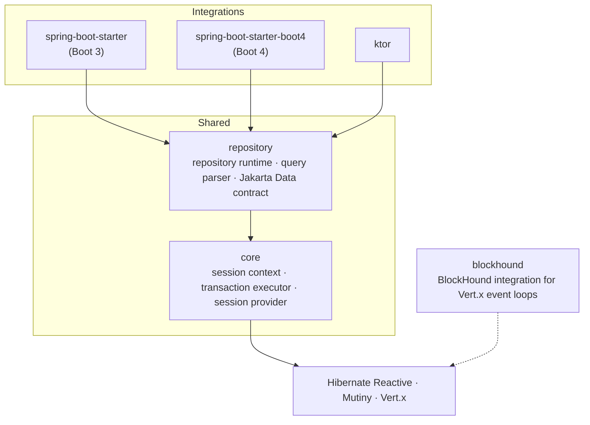
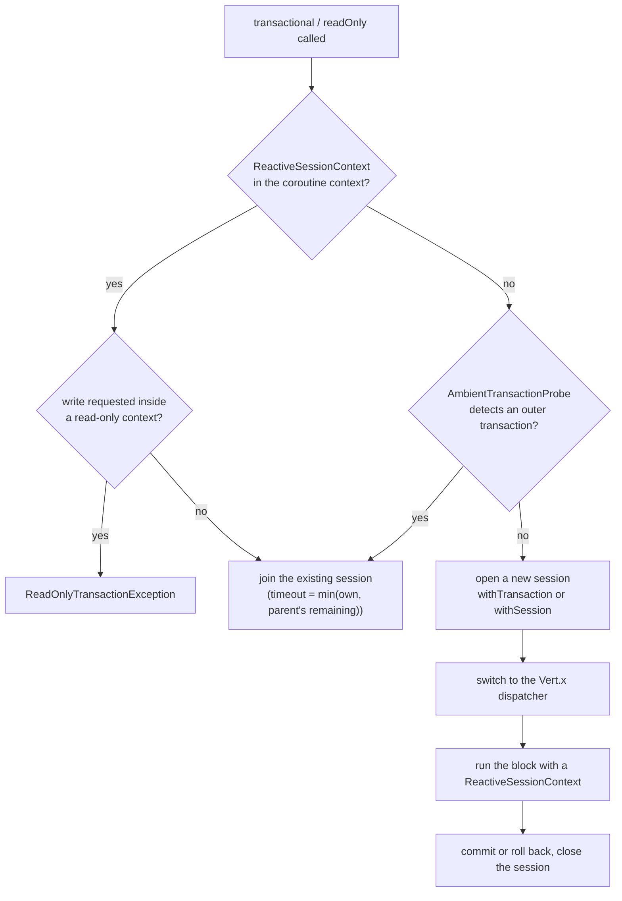
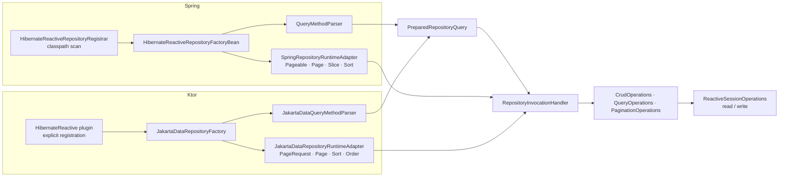

# Internals

How sessions and transactions travel with coroutines, and how a repository proxy turns a method
call into a query. For how to use the library, see the [Usage Guide](usage-guide.md).

## 1. Modules



| Module | Responsibility | Depends on |
| --- | --- | --- |
| `core` | `ReactiveSessionContext`, `ReactiveTransactionExecutor`, `ReactiveSessionProvider` | Hibernate Reactive, Mutiny Kotlin, Vert.x, kotlinx.coroutines |
| `repository` | repository runtime, derived-query parser, `@Query` annotations, Jakarta Data-based `CoroutineCrudRepository` | `core`, Jakarta Data API |
| `spring-boot-starter`, `-boot4` | auto-configuration, `@Transactional` integration, Spring Data type adapters, auditing | `repository`, Spring Boot BOM |
| `ktor` | application plugin, resource ownership, Ktor DI bridge | `repository`, Ktor Server |
| `blockhound` | marks Vert.x event-loop threads as non-blocking for BlockHound | BlockHound, Vert.x |

The two Spring starters share a single source tree, `spring-boot-starter-common/src`, compiled once
against the Boot 3 BOM and once against the Boot 4 BOM. Classes that differ between Boot versions
are referenced by string name.

## 2. Sessions and the Coroutine Context

### 2.1 ReactiveSessionContext

The unit of session propagation is `ReactiveSessionContext`, a `CoroutineContext.Element`. Every
`suspend` function called inside a `withContext(context)` block sees the same session.

| Field | Meaning |
| --- | --- |
| `session` | the shared `Mutiny.Session` |
| `mode` | `READ_ONLY` or `READ_WRITE` |
| `timeout` | time budget for the block |
| `startTimeNanos` | start time for computing remaining budget, based on `System.nanoTime()` |

`currentContextOrNull()` pulls the element out of the current coroutine context, or returns null.

### 2.2 Vert.x Thread Affinity

A Hibernate Reactive session is bound to the Vert.x event-loop thread that created it; using it
from any other thread raises `HR000069`. Every code path that opens a session therefore captures
the Vert.x context and switches the coroutine onto that context's dispatcher before running the
block.

- `ReactiveTransactionExecutor` grabs the current Vert.x context inside the `withTransaction`
  callback and runs the block on its dispatcher.
- Spring's `MutinySessionHolder` stores the Vert.x `Context` alongside the session, and every
  repository call does `withContext` on that dispatcher.

Switching dispatchers or `launch`ing a detached coroutine inside the block breaks this affinity.

### 2.3 ReactiveSessionProvider

The repository runtime only ever obtains a session through `read` and `write` on
`ReactiveSessionOperations`. The default implementation, `ReactiveSessionProvider`, does this:

1. If the coroutine context holds a `ReactiveSessionContext`, reuse it. A `write` in a read-only
   context throws `ReadOnlyTransactionException`.
2. Otherwise open a fresh session, with `withSession` for `read` or `withTransaction` for `write`,
   and close it when the block finishes.

The Spring starter swaps in a subclass, `TransactionalAwareSessionProvider`
([section 3.3](#33-spring-transactionalawaresessionprovider)).

## 3. Transactions

### 3.1 ReactiveTransactionExecutor

`transactional {}` and `readOnly {}` both funnel into `executeInSession`.



`AmbientTransactionProbe` is the hook that lets `core` notice a Spring `@Transactional` without
knowing about Spring. The Spring starter registers `SpringAmbientTransactionProbe`; without it,
`tx.transactional {}` inside `@Transactional` would open a second session that nothing uses.

When a new session is opened, the caller's coroutine context minus its `Job` is merged with the
Vert.x dispatcher, which is why MDC and Reactor context survive inside the block.

A session opened by `readOnly` is set to `setDefaultReadOnly(true)` with manual flush mode, so
dirty checking never runs.

### 3.2 Spring: HibernateReactiveTransactionManager

`@Transactional` is handled by this subclass of `AbstractReactiveTransactionManager`. Transaction
state lives in a `MutinySessionHolder` bound to the `TransactionSynchronizationManager`, which
propagates through the Reactor context into `suspend` functions.

| Phase | What happens |
| --- | --- |
| `doBegin` | open a session and begin a transaction; capture the Vert.x `Context` inside the callback and store it in the holder |
| block | repository calls go through `TransactionalAwareSessionProvider` and reuse this session |
| `doCommit` | roll back if the deadline has passed; otherwise `flush()` then commit, rolling back if flush fails |
| `doRollback` | roll back |
| `doCleanupAfterCompletion` | close the session and release the holder |

Every phase runs on the Vert.x event loop that created the session.

On `Propagation.REQUIRES_NEW`, `doSuspend` parks the parent holder and a fresh child session is
opened. The parent keeps its connection while it waits, so under load the pool drains. The code
does not refuse it, but nested use is unsupported for that reason.

### 3.3 Spring: TransactionalAwareSessionProvider

Adds one step in front of `ReactiveSessionProvider`:

1. **`@Transactional` context**: find the `MutinySessionHolder` in the Reactor context and use its
   session on the holder's dispatcher.
2. **`ReactiveSessionContext`**: reuse a session opened by `tx.transactional {}`.
3. **New session**: open one.

On path 1, the deadline is checked before and after each repository call; if it has passed,
`TransactionTimedOutException` is thrown and the holder is marked rollback-only. `fetch()`,
`fetchAll()`, and `fetchFromDetached()` also live here and call `Mutiny.Session.fetch` on the
current session.

### 3.4 Transaction Timeouts

`@Transactional(timeout = ...)` is enforced at two levels.

- **Application level**: `MutinySessionHolder` records the start time, and the remaining budget is
  checked around repository calls and before commit.
- **Database level**: on PostgreSQL only, `TransactionTimeoutConfigurer` issues
  `SET LOCAL statement_timeout` and refreshes it with the remaining budget before each repository
  call and flush. `SET LOCAL` expires with the transaction, so nothing leaks into pooled
  connections.

Hibernate Reactive has no query-cancellation API, so other databases get the application level
only. `ReactiveTransactionExecutor` has to stay framework-neutral and uses coroutine `withTimeout`
alone.

## 4. Repository Runtime

### 4.1 Shared Structure

All real behavior of a repository proxy lives in the `repository` module. Spring and Ktor differ
only in how they discover interfaces and which paging types they speak.



| Extension point | Role | Spring | Ktor |
| --- | --- | --- | --- |
| `PreparedRepositoryQuery` | per-method query metadata, parsed up front | `QueryMethodParser` | `JakartaDataQueryMethodParser` |
| `RepositoryRuntimeAdapter` | translates paging and sorting types | `SpringRepositoryRuntimeAdapter` | `JakartaDataRepositoryRuntimeAdapter` |
| `RepositoryEntityLifecycle` | new-entity detection and pre-save hook | `Persistable` first, then auditing | default |

When `RepositoryEntityLifecycle.isNew` returns null, `EntityStateDetector` decides: by whether
`@Version` is null if present, otherwise by whether `@Id` is null or the primitive default.

### 4.2 Startup Preparation

Before a proxy is created, the parser walks every declared method and produces a
`PreparedRepositoryQuery`. It validates the following and aborts startup on failure:

- the method is `suspend`, or one of the base methods allowed to return `Flow`
- every property path in a derived query exists on the entity
- `@Query` parameters match the method parameters, and positional ones run contiguously from `?1`
- the return type and statement kind of `@Modifying` agree
- for a `Page`-returning `@Query` without `countQuery`, `CountQueryDeriver` can build a COUNT

Runtime routing keys only on method name and arity, which is why overloads sharing both are
rejected here.

### 4.3 Invocation

The proxy is a JDK dynamic proxy, and `RepositoryInvocationHandler` receives every call. A
`suspend` function compiles to a JVM method whose last argument is a `Continuation`, so the handler
tells the two call styles apart by that last argument.

1. `toString`, `hashCode`, and `equals` are answered by the proxy itself.
2. No `Continuation` and the method is `findAll`, `findAllById`, or `saveAll`: a `Flow` is returned.
   It loads the whole result on collect, then emits.
3. A `Continuation` is present: the handler enters a coroutine and routes by method name. Base CRUD
   goes to `CrudOperations`; declared methods look up their `PreparedRepositoryQuery` and go to
   `QueryOperations`.

Right before execution, `RepositoryRuntimeAdapter.adaptArguments` peels paging and sorting
arguments off into neutral types; for page results, `createPage` or `createSlice` wraps the outcome
back into the framework's type.

### 4.4 Derived Query Parsing

`DerivedQueryParser` parses method names without Spring Data and produces a `DerivedQuery`, whose
predicate is a list of AND groups joined by OR.

```text
findAllByStatusAndNameContainingOrderByCreatedAtDesc
│         │      │   │           │       │
│         │      │   │           │       └─ order: createdAt DESC
│         │      │   │           └─ keyword: OrderBy
│         │      │   └─ keyword: Containing
│         │      └─ property: name
│         └─ keyword: And
└─ prefix: findAllBy (returns a list)
```

`PropertyPathResolver` matches property names against the fields and getters of the entity class
hierarchy. Nested paths such as `findByAddressCity` are resolved by splitting the camel case
longest-prefix-first.

`DerivedQueryHqlCompiler` turns the `DerivedQuery` into HQL. A `Sort` or `Pageable` supplied at
call time overrides the `OrderBy` from the method name. The same compiler produces the COUNT,
`existsBy`, and `deleteBy` variants.

```sql
SELECT e FROM Entity e
WHERE e.status = ?1 AND e.name LIKE ?2 ESCAPE '\'
ORDER BY e.createdAt DESC
```

### 4.5 @Query Handling

`QueryParameterParser` checks parameter style: named and positional cannot mix, and positional
parameters must run contiguously from `?1`. Dollar quoting and comments are rejected because
Hibernate's HQL parser and native parser handle them differently.

For a `Page` result without `countQuery`, `CountQueryDeriver` builds a COUNT from the body. Any
construct that could change the row count (projections, joins, `GROUP BY`, set operations) aborts
startup with a message asking for an explicit `countQuery`. `QueryAliasResolver` prefixes sort
expressions with the root alias and allows only plain root properties.

## 5. Ktor Plugin Lifecycle

On install, the `HibernateReactive` plugin builds its resources in this order:

1. **Vert.x**: the configured `vertx`; otherwise the one discovered from `sessionFactory` through
   the `Implementor` SPI; otherwise a new, owned instance. Configuring both with different
   instances fails.
2. **Session factory**: if none was supplied, one is built from `database {}` and the registered
   entities through `ReactiveServiceRegistryBuilder`, and owned.
3. **Shared resources**: `ReactiveSessionProvider` and `ReactiveTransactionExecutor`.
4. **Repositories**: a proxy per registered interface via `JakartaDataRepositoryFactory`. The
   entity name is the registered value, then `@Entity(name)`, then the class name.
5. **DI**: with `dependencyInjection = true`, `KtorDependencyInjectionBridge` publishes
   repositories and resources to Ktor DI. `ktor-server-di` is `compileOnly`, so it is only needed
   if you use it.

A failure at any step closes what was already built and rethrows.

Shutdown runs on `ApplicationStopping`. `close()` executes once, closing the owned session factory
and then the owned Vert.x. External resources are closed only when their `closeExternal...` flag is
set.

## 6. Spring Auto-configuration

`HibernateReactiveAutoConfiguration` activates when `Mutiny.SessionFactory` is on the classpath.
Every bean is `@ConditionalOnMissingBean`, so application-defined beans win.

| Bean | Role |
| --- | --- |
| `Vertx` | instance built from `hibernate.reactive.vertx` settings |
| `hibernateSessionFactory` | Hibernate `SessionFactory` with the JDBC URL translated and SSL applied |
| `Mutiny.SessionFactory` | the Mutiny view of that factory |
| `ReactiveSessionProvider` | `core`'s default session provider |
| `AmbientTransactionProbe` | `SpringAmbientTransactionProbe` |
| `ReactiveTransactionExecutor` | wired with the probe above |
| `ReactiveTransactionManager` | `HibernateReactiveTransactionManager` |
| `TransactionalEventPublisher` | publisher for `@TransactionalEventListener` |
| `TransactionalAwareSessionProvider` | the session provider repositories use |

- **Repository registration**: `HibernateReactiveRepositoryAutoConfiguration` registers a
  `HibernateReactiveRepositoryRegistrar` that scans the `@SpringBootApplication` package for
  `CoroutineCrudRepository` subinterfaces and adds a `HibernateReactiveRepositoryFactoryBean` for
  each. `@EnableHibernateReactiveRepositories` replaces that registrar with one scoped to the given
  packages.
- **Auditing**: `AuditingAutoConfiguration` creates a `ReactiveAuditingHandler` only when a
  `ReactiveAuditorAware` bean exists, and `SpringRepositoryEntityLifecycle.beforeSave` fills
  `@CreatedBy` and `@LastModifiedBy` from it. `@CreatedDate` and `@LastModifiedDate` are handled by
  the JPA callbacks in `AuditingEntityListener`.
- **Event-loop sharing**: `VertxEventLoopSharingAutoConfiguration` activates when
  `share-event-loops` is true and registers `VertxLoopResources` ahead of Spring Boot's
  `reactorResourceFactory`, so the embedded Netty server runs on Vert.x loops. It references the
  Boot 3 and Boot 4 web-server auto-configurations by string name.
